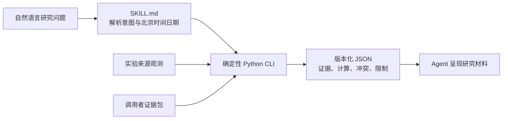

<div align="center">

# A股研究技能

**让每个研究数字都带着身份、时点、来源和计算谱系。**

[](https://www.python.org/)
[](skill/a-share-research/)
[](https://github.com/RedHeartSecretMan/a-share-research-skill/releases/tag/v0.0.1)
[](LICENSE)

[English](README_en.md) · [安装](#安装) · [常见用法](#常见用法) · [案例 Demo](#案例-demo) · [能力边界](#能力边界) · [开发验证](#开发验证)

</div>

`a-share-research-skill` 是项目仓库名，可安装 Skill 名为 `$a-share-research`。它以 evidence-first 的方式处理 A 股研究：确定性 Python CLI 负责证券身份、研究时点、证据校验和估值计算，再由 Agent 把版本化 JSON 呈现为可核验的研究材料。

项目不把“接口返回了数据”当成“事实已经可信”，也不输出荐股、目标价、仓位建议或便宜/昂贵判断。

## 为什么需要它

普通取数工具关注“能拿到多少数据”；本项目关注“这个数字能否进入研究结论”：

- **身份明确**：证券与发行主体分离；名称、简称和裸代码只是线索，不能静默猜测交易所。
- **时间明确**：每次研究锚定北京时间日期，区分证据时点、公开时点和获取时间，拒绝前视信息。
- **来源明确**：事实主张必须关联来源定位和证据项；格式完整不等于来源已核验。
- **计算可复算**：总市值、PE TTM 和 PB MRQ 使用 Decimal 与显式口径形成完整计算谱系。
- **失败要诚实**：歧义、冲突、陈旧、错证券或关键证据缺失时返回 `limited` / `blocked`，不补猜数字。

## 当前预览能力

| 能力 | 输入 | 输出与边界 |
| --- | --- | --- |
| 证券身份解析 | 名称、简称或代码线索 + 明确日期 | 交叉核验 SSE/SZSE 与巨潮观测；歧义、冲突和 BSE 输入失败关闭 |
| 最近完成收盘价 | 规范的 `SSE:code` / `SZSE:code` + 明确日期 | 交叉核验交易所日线与腾讯观测，保留交易日、价格口径和冲突 |
| 证据包校验 | 调用者提供的 `manifest.json` 与可选材料 | 校验身份、时间、单位、口径、哈希、定位信息和证据关系 |
| 提供证据估值 | 已校验证据包 + 明确日期 | 计算总市值、PE TTM、PB MRQ；保留公式、操作数和报告谱系 |

实验来源可以提供观测并暴露冲突，但尚未完成操作级资格审查，不能单独让事实主张达到 `supported`。调用者提供的证据即使字段和哈希完整，也不会被自动宣称为已完成来源核验。

## 工作方式



研究结果使用三个整体状态：

- `supported`：关键事实主张均有适用且完成来源核验的证据。
- `limited`：仍能回答核心问题，但存在必须披露的非关键缺口、冲突或来源限制。
- `blocked`：身份或关键证据不足，必须停止实质结论。

## 安装

唯一安装产物是 [`skill/a-share-research`](skill/a-share-research/)。克隆仓库后，将整个目录复制到兼容 Agent 的 Skill 目录；不要只复制 `SKILL.md`。

```text
git clone https://github.com/RedHeartSecretMan/a-share-research-skill.git

<skills-directory>/a-share-research/
├── SKILL.md
├── agents/openai.yaml
├── references/
└── scripts/
```

运行时仅需要 Python 3.12 或更高版本的标准库，不需要安装项目包或第三方 Python 依赖。跨平台解释器选择和调用约定见 [`references/cli-contract.md`](skill/a-share-research/references/cli-contract.md)。

## CLI

新能力统一通过稳定的研究任务 Interface 调用：

```text
<python> <skill-root>/scripts/entrypoint.py run --request <research-task.json>
```

`research-task.json` 是结构化任务，不是自然语言文本，包含版本、任务类型、标的、研究日期、窗口、参数和来源策略。未知任务、策略不允许的来源或缺失的可选 Adapter 依赖会返回明确的 `blocked` 结果。

以下四个命令在迁移期保留为兼容入口。

实验来源身份与收盘价研究：

```text
<python> <skill-root>/scripts/entrypoint.py resolve --query <security-clue> --as-of <YYYY-MM-DD>
<python> <skill-root>/scripts/entrypoint.py close --security <SSE:code|SZSE:code> --as-of <YYYY-MM-DD>
```

提供证据估值研究：

```text
<python> <skill-root>/scripts/entrypoint.py validate-bundle --bundle <bundle-directory>
<python> <skill-root>/scripts/entrypoint.py valuation --bundle <bundle-directory> --as-of <YYYY-MM-DD>
```

`scripts/entrypoint.py` 是 Skill 唯一的公共运行入口；其他 Python 模块均为内部实现。CLI 不处理自然语言、不调用模型。`stdout` 只输出版本化 JSON，`stderr` 只输出诊断；有效的 `limited` 或 `blocked` 研究结果仍以零退出码返回。

## 常见用法

v0.0.1 预览围绕四个公开工作流提供以下用法。安装后使用 `$a-share-research` 显式调用 Skill；你可以使用“今天”或“当前”，Agent 会先将其解析为具体的北京时间日期。

**找对证券**

> 使用 `$a-share-research`，帮我确认“贵州茅台（600519）”对应哪个交易所和规范证券代码，并说明结果截至哪一天。

**查询最近收盘价**

> 使用 `$a-share-research`，查询 `SSE:600519` 截至今天最近一个完整交易日的未复权收盘价，并告诉我数据来源、是否一致以及有哪些限制。

**检查研究资料**

> 使用 `$a-share-research`，检查 `/path/to/evidence-bundle` 里的研究证据是否完整、口径是否一致，并按优先级告诉我还需要补什么。

**计算常用估值**

> 使用 `$a-share-research`，根据 `/path/to/evidence-bundle` 计算总市值、PE TTM 和 PB MRQ，并给出计算日期、公式、关键输入和证据限制；如果资料不足，直接告诉我缺什么。

## 案例 Demo

v0.0.1 使用两个真实证券验证“自然语言线索 → 规范证券身份 → 最近完成收盘价 → Agent 证据说明”的基础链路，分别覆盖深交所和上交所。这是技术验证，不是完整个股研究案例：

- [蓝色光标（SZSE:300058）](examples/bluefocus.md)
- [工业富联（SSE:601138）](examples/industrial-fulian.md)

案例中的数值是截至 `2026-08-02` 的固定现场记录，用于展示输出口径与限制；重新运行时应以新的显式研究日期和 CLI 返回证据为准。

## 能力边界

当前预览版本有意保持保守：

- 联网身份与收盘价 tracer 仅覆盖 SSE、SZSE；BSE 不会回退到其他市场。
- 免费联网操作均为实验来源，不等于正式生产 Adapter。
- 不自动获取有效总股本、财务报表、TTM 归母净利润或 MRQ 归母净资产。
- 不支持盘中实时、分钟、逐笔、交易、新闻情绪、全量公司画像或批量选股。
- 不输出评级、目标价、买卖建议、仓位建议或自动交易指令。

完整产品边界见 [`CONTEXT.md`](CONTEXT.md)，当前内核规格见 [`docs/specs/0002-trustworthy-a-share-research-foundation.md`](docs/specs/0002-trustworthy-a-share-research-foundation.md)，真正 v0.1.0 的能力与发布门槛见 [`docs/specs/0003-full-a-share-research-v0.1.0.md`](docs/specs/0003-full-a-share-research-v0.1.0.md)。

## 仓库结构

```text
skill/a-share-research/        唯一安装产物
tests/                         离线契约、回归与分发测试
examples/                      v0.0.1 身份与单日收盘价验证案例
docs/adr/                      架构决策
docs/research/                 带时间锚的来源可行性调查
docs/specs/                    产品与实现规格
CONTEXT.md                     领域语言与边界
```

## 开发验证

默认测试完全离线；真实来源探针必须显式运行，不属于普通 CI 门禁。

```text
python3.12 -m unittest discover -s tests -p "test_*.py"
ruff check .
ruff format --check .
mypy skill/a-share-research/scripts
python /path/to/skill-creator/scripts/quick_validate.py skill/a-share-research
```

真实来源诊断入口为 `tests/live_probe_close.py`。它不会更新夹具，也不能降低证据要求。

## 许可证与来源

项目采用 [Apache-2.0](https://github.com/RedHeartSecretMan/a-share-research-skill/blob/main/LICENSE) 许可证。项目源自 [simonlin1212/a-stock-data](https://github.com/simonlin1212/a-stock-data)，并保留其版权与归属；当前实现根据可信证据契约重新构建，并作为独立项目维护。
