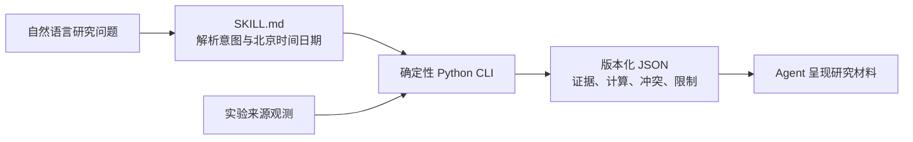

<div align="center">

# A股研究技能

**让每个研究数字都带着身份、时点、来源和计算谱系。**

[](https://www.python.org/)
[](skill/a-share-research/)
[](https://github.com/RedHeartSecretMan/a-share-research-skill/tree/v0.2.0)
[](LICENSE)

[English](README_en.md) · [安装](#安装) · [常见用法](#常见用法) · [案例 Demo](#案例-demo) · [能力边界](#能力边界) · [开发验证](#开发验证)

</div>

`a-share-research-skill` 是项目仓库名，可安装 Skill 名为 `$a-share-research`。它以 evidence-first 的方式处理 A 股研究：确定性 Python CLI 负责证券身份、研究时点、证据校验和估值计算，再由 Agent 把版本化 JSON 呈现为可核验的研究材料。

项目不把“接口返回了数据”当成“事实已经可信”，而是在证券身份、研究时点、来源、口径和假设明确后，提供可核验的研究分析。

## 为什么需要它

普通取数工具关注“能拿到多少数据”；本项目关注“这个数字能否进入研究结论”：

- **身份明确**：证券与发行主体分离；名称、简称和裸代码只是线索，不能静默猜测交易所。
- **时间明确**：每次研究锚定北京时间日期，区分证据时点、公开时点和获取时间，拒绝前视信息。
- **来源明确**：事实主张必须关联来源定位和证据项；格式完整不等于来源已核验。
- **计算可复算**：总市值、PE TTM 和 PB MRQ 使用 Decimal 与显式口径形成完整计算谱系。
- **失败要诚实**：歧义、冲突、陈旧、错证券或关键证据缺失时返回 `limited` / `blocked`，不补猜数字。

## 能力

| 能力 | 输入 | 输出与边界 |
| --- | --- | --- |
| 证券身份解析 | 名称、简称或代码线索 + 明确日期 | 交叉核验 SSE/SZSE 与巨潮观测；歧义、冲突和 BSE 输入失败关闭 |
| 最近完成收盘价 | 规范的 `SSE:code` / `SZSE:code` + 明确日期 | 交叉核验交易所日线与腾讯观测，保留交易日、价格口径和冲突 |
| 最近 N 日走势 | A 股线索 + 2–250 个交易日 + 未复权/前复权口径 | 双源 OHLCV、累计涨跌、最大回撤、年化波动、涨跌天数、量能变化与公司行动说明 |
| 盘中行情快照 | 当前北京时间交易日 + 一只规范 `SSE:code` / `SZSE:code` A 股 | 通达信与腾讯实验操作交叉核验的单次盘中快照；保留会话、价格类型、来源时点、单位、冲突与 `limited` / `blocked` 限制 |
| ETF 行情 | 上交所 ETF 六位代码 + 明确日期 | 上交所 ETF 身份和快照、腾讯价格交叉、成交量手/股舍入差说明 |
| ETF 期权 | 510050 / 510300 / 510500 / 588000 + 单一观测日 + ATM/期权链、到期日与行情时点模式 | 分开保留标准 `M` 与调整 `A` 系列、认购/认沽报价、并列 ATM、供应商报告 Greeks/IV、四态 coverage、来源时点与限制 |
| 自动单票估值 | A 股线索 + 已确认证券类别数 + 当前北京时间日期 + 情景目标 PE | 保留三表完整数值行和季度序列，取得当前总股本快照与一致预期，计算总市值、PE TTM、PB MRQ、前向 PE、预测增长、PEG 与 PE 消化时间 |
| 同口径批量估值 | 2–10 个不同 A 股线索 + 共同日期/目标 PE | 按输入顺序保留全部标的；统一价格与指标口径，显式呈现不可计算、无估值意义及阻断行 |
| 研究内容检索 | 主题/行业或单只 A 股 + 发表时间窗 + 材料类型 | 个股/行业研报、一致预期、F10 上市公司资料、新闻、巨潮/上交所/深交所公告、市场快讯和互动易；保留观点角色、发布时间、获取时间、文档身份与定位 |
| 资金、筹码与公司事件 | 单只 A 股或全市场/板块范围 + 观测时间窗 + 数据类型 | 北向披露缺口、个股/板块资金流、个股及全市场龙虎榜、未来 90 日解禁、两融、大宗、股东户数和分红送转；逐项保留周期、单位、方向与市场范围 |
| 市场题材与交易信号 | 单只 A 股线索或全市场范围 + 明确观测日 + 信号类型 | 强势题材、个股板块归属、行业轮动、涨跌停池、重点监控、严重异常波动、规范身份交叉和市场热度；保留规则、归因来源、四态 coverage、冲突与限制 |

实验来源可以提供观测并暴露冲突，但尚未完成操作级资格审查，不能单独让事实主张达到 `supported`。

这里的 **F10 资料**，是中国证券行情软件通常通过“F10”入口汇总展示的上市公司材料。v0.1.1 可检索最新提示、公司概况、财务分析、股东研究、股本结构、资本运作、业内点评、行业分析和公司大事。它们是供应商整理的文本材料，不是交易所统一数据标准，也不等同于公司法定披露或已经核验的公司事实。

## 工作方式



研究结果使用三个整体状态：

- `supported`：关键事实主张均有适用且完成来源核验的证据。
- `limited`：仍能回答核心问题，但存在必须披露的非关键缺口、冲突或来源限制。
- `blocked`：身份或关键证据不足，必须停止实质结论。

## 分析边界

CLI 负责证据、确定性计算、状态和限制；Agent 可以在未被整体阻断且问题需要解释时给出研究判断、风险、失效条件、条件触发位和后续研究建议。身份核对等直接证据问题不附加无关判断，整体 `blocked` 时只说明缺口与继续研究所需证据。

本节仅作用户导览。研究判断、条件触发位、外部署名观点和投资行动建议的规范执行边界，以安装产物中的 [`references/analysis-boundary.md`](skill/a-share-research/references/analysis-boundary.md) 为准；最终投资决策由研究者作出。

## 安装

唯一安装产物是 [`skill/a-share-research`](skill/a-share-research/)。克隆仓库后，将整个目录复制到兼容 Agent 的 Skill 目录；不要只复制 `SKILL.md`。

```text
git clone --depth 1 --branch v0.2.0 --single-branch https://github.com/RedHeartSecretMan/a-share-research-skill.git

<skills-directory>/a-share-research/
├── SKILL.md
├── agents/openai.yaml
├── references/
└── scripts/
```

核心运行时仅需要 Python 3.12 或更高版本的标准库，不需要安装项目包。下文以 `<python>` 表示已经确认版本不低于 3.12 的解释器：Windows 通常使用 `py -3.12`，macOS 和 Linux 优先使用 `python3.12`；只有在 `python3 --version` 已确认满足要求时才使用 `python3`。完整调用约定见 [`references/cli-contract.md`](skill/a-share-research/references/cli-contract.md)。

F10 上市公司资料检索和 `intraday_market_signal` 盘中快照是 v0.1.1/v0.2.0 能力域中按需启用、但需要额外依赖的能力。它们声明的是 capability-scoped optional dependency（按能力范围锁定的可选依赖），需要时在运行对应 Skill 的同一个 Python 环境中安装发布审计验证过的版本：

```text
<python> -m pip install "mootdx==0.11.7"
```

标准库核心安装不包含 `mootdx`。缺少它时，只有请求 F10 或 `intraday_market_signal`（以及明确依赖它们的步骤）会显式返回 `missing_optional_dependency` / `blocked`，其他研究能力不受影响；运行时不得静默切换来源、伪造空数据或扩大阻断范围。维护者 live probe 使用临时 home，不写入项目全局配置。

`mootdx` 的 F10 与 `intraday_market_signal` 接入各自受能力范围和版本 pin 约束；它提供的其他行情接口不会因“同属一个库”就自动成为默认来源或 fallback。每个来源操作都必须分别完成身份、时点、单位、失败语义和许可资格审查，确认能改善证据链后才会接入；盘中任务只接受当前北京时间交易日的一只规范 SSE/SZSE A 股，来源不足时失败关闭，不进行 silent source switch。

## CLI

所有能力统一通过稳定的研究任务 Interface 调用：

```text
<python> <skill-root>/scripts/entrypoint.py run --request <research-task.json>
```

`research-task.json` 是结构化任务，不是自然语言文本，包含版本、任务类型、标的、研究日期、窗口、参数和来源策略。未知任务、策略不允许的来源或缺失的可选 Adapter 依赖会返回明确的 `blocked` 结果。

`run --request` 是唯一受支持的公共调用形式；调用者不需要了解来源端点、内部模块或历史子命令。`scripts/entrypoint.py` 是 Skill 唯一的公共运行入口，其他 Python 模块均为内部实现。CLI 不处理自然语言、不调用模型。`stdout` 只输出版本化 JSON，`stderr` 只输出诊断；有效的 `limited` 或 `blocked` 研究结果仍以零退出码返回。

盘中快照使用 `task_type: "intraday_market_signal"`，`subjects` 必须恰好包含一个已经规范化的 `SSE:<code>` 或 `SZSE:<code>` A 股，`as_of` 必须是当前北京时间交易日，`window` 为 `null`，并显式设置 `source_policy.allow_experimental: true`。`limited` 表示快照仍可回答但实验来源资格或其他限制必须披露；`blocked` 表示身份、会话、时点或核心来源证据不足。Agent 只能在非阻断结果上依据返回字段形成标注清楚的分析，不能把结果当作交易级行情或投资行动建议。

### 预置研究方案

`research_workflow` 提供四个固定、版本化的请求方案。它们是常见研究问题的便捷编排，不是独立的数据能力，也不开放自定义步骤或依赖图：

| 方案 ID | 适用问题 | 编排内容 |
| --- | --- | --- |
| `single_security_valuation` | 单只证券估值 | 调用现有 `security_valuation` 任务 |
| `valuation_comparison` | 多只证券同口径比较 | 调用现有 `valuation_compare` 任务并保留全部行 |
| `theme_report_research` | 主题研报检索 | 调用现有 `research_content` 任务 |
| `new_security_research` | 新标的首次系统研究 | 身份 → 机构覆盖 → 估值 → 板块归属 → 资金流 → 龙虎榜 → 解禁 → 两融 |

每个方案都继承请求的研究日期和来源策略，并完整保留叶子任务的状态、证据、冲突、来源错误与限制。新标的方案以身份为门禁；其他步骤阻断时，不依赖该步骤的研究仍会继续，但整体结果不会被描述成完整或已支撑。

## 常见用法

安装后使用 `$a-share-research` 显式调用 Skill；你可以使用“今天”或“当前”，Agent 会先将其解析为具体的北京时间日期。以下用法与 v0.2.0 交付基线的实际任务契约一致。

**找对证券**

> 使用 `$a-share-research`，帮我确认“贵州茅台（600519）”对应哪个交易所和规范证券代码，并说明结果截至哪一天。

**查询最近收盘价**

> 使用 `$a-share-research`，查询 `SSE:600519` 截至今天最近一个完整交易日的未复权收盘价，并告诉我数据来源、是否一致以及有哪些限制。

**查询盘中行情快照**

> 使用 `$a-share-research`，查询 `SSE:600519` 今天当前时点的研究级盘中行情快照。保留交易会话、价格类型、两路来源观测时间、最新价、开高低、昨收语义、累计成交量和成交额、字段血缘、冲突与限制；如果当前不是适用盘中会话，或任一来源证据不足，返回 `blocked`，不要用最近收盘价替代。

**研究最近走势**

> 使用 `$a-share-research`，研究蓝色光标截至今天最近 10 个完整交易日的未复权走势，给出 OHLCV、累计涨跌、最大回撤、波动、涨跌天数和量能变化，并基于这些证据解释趋势、主要风险和判断失效条件。将结论标为 Agent 推断；如给出条件触发位，说明规则和研究周期，不要写成买卖指令。

**查询 ETF 行情**

> 使用 `$a-share-research`，查询 510050 上证 50ETF 截至今天的当前或最近完成行情，告诉我现价、涨跌幅、成交量、成交额、观测时间、两源是否一致以及限制。

**研究 ETF 期权**

> 使用 `$a-share-research`，查看 510050 上证 50ETF 最近未到期月份、最近完整交易时点的 ATM 认购和认沽，保留报价状态、买卖价、最新价、成交量、持仓量、供应商报告 Greeks/IV、单位、观测时间、来源与限制。

> 使用 `$a-share-research`，查看 510300 沪深 300ETF 在指定到期日由来源观察到的期权链，使用最近完整行情；将标准 `M` 与调整 `A` 系列分开，并保留同距并列 ATM 和合约总量限制。

> 使用 `$a-share-research`，查看 510500 中证 500ETF 最近未到期月份由来源观察到的期权链，允许最新日内行情，并明确交易时段是否完成以及覆盖是否完整。

> 使用 `$a-share-research`，查看 588000 科创 50ETF 在指定到期日的 ATM 期权，允许最新日内行情；如果来源返回了其他 ETF、缺少合约或无可用报价，直接阻断而不是回退或补猜。

这里的“供应商报告”表示 Delta、Gamma、Theta、Vega 和隐含波动率由来源直接给出，不是本项目本地运行 BSM，也不是交易所计算值。Gamma、Theta、Vega 的供应商原生单位尚未独立核验；IV 使用小数比例。当前来源不提供权威合约总量、完整合约单位或调整条款，也没有合格的独立 fallback，因此结果必须保留 coverage 与限制。

**使用单票估值预置方案**

> 使用 `$a-share-research`，研究工业富联截至今天的估值。先确认发行主体是否只有一个需要计价的普通股证券类别；以最近完整交易日未复权收盘价为准，计算总市值、PE TTM、PB MRQ、首个预测年度前向 PE、预测 EPS 增长、PEG，以及回落到 30 倍 PE 的理论消化时间；区分镜像财务观测、机构一致预期和情景假设，并基于明确基准解释估值压力、关键假设与重新评估条件。

**使用批量估值对比预置方案**

> 使用 `$a-share-research`，按同一个日期、未复权收盘价口径和 30 倍目标 PE，对比工业富联、贵州茅台、宁德时代、美的集团和五粮液。先确认每个发行主体的证券类别范围；保留每只股票的缺失项和限制，不要因为某项不可计算就删掉标的。

**使用主题研报预置方案**

> 使用 `$a-share-research`，检索最近 90 天“人形机器人、丝杠、减速器”相关研报，按发布时间列出标题、作者、来源和 PDF 定位；合并同一文档的重复结果，并把机构观点与已披露事实分开。

**使用新标的研究预置方案**

> 使用 `$a-share-research`，把工业富联作为新标的做一轮完整研究：先核验身份，再依次查看机构研报与一致预期、当前估值、供应商板块归属、最近 5 日资金流、龙虎榜、未来 90 日解禁和融资融券。每一步都保留证据时点、公开时点、获取时间、状态和限制；某一步不可用时继续执行不依赖它的步骤，但不要把流程说成完整或已支撑。

**研究个股公告与新闻**

> 使用 `$a-share-research`，查询蓝色光标最近 30 天的公司公告和个股新闻。公告优先保留巨潮或交易所原文定位，按时间说明发生了什么、哪些只是媒体报道，以及目前证据还有什么缺口。

**看市场快讯**

> 使用 `$a-share-research`，汇总今天截至当前获取时间的市场快讯，保留每条快讯的原始发布时间和来源；不要把来源失败解释成“今天没有消息”。

**查看互动易问答**

> 使用 `$a-share-research`，整理蓝色光标最近 90 天互动易中投资者最常问的主题。先从原始问答提出候选主题，再用候选主题词做可复核的字面频次统计；分别保留提问时间、公司回复时间和原文定位，公司回复按署名陈述呈现，不自动当作已核验事实。

**看个股与板块资金**

> 使用 `$a-share-research`，分两次运行：查看工业富联最近 5 个完整交易日的主力及分档资金净流入；再列出供应商当前榜单所对应交易日的行业板块主力净流入前 10 名。分别说明统计周期、金额单位、正负方向、适用市场、榜单获取时间和交易时段完整性是否可确认；不要把供应商资金分类当作公司基本面事实。

**查龙虎榜和解禁**

> 使用 `$a-share-research`，检查蓝色光标最近 30 天是否上过龙虎榜，列出最近一次买卖席位 TOP5 和机构净额；再单独检查未来 90 天限售解禁。保留上榜原因、席位金额单位、解禁股数及占比口径，来源为空时不要回答“没有”。

**研究两融、筹码和分红**

> 使用 `$a-share-research`，整理工业富联最近的融资融券余额、大宗交易、股东户数变化和历史分红送转。区分交易日、报告期和实施日，逐个指标给出单位与方向；股东户数变化只描述筹码分布现象，不推断主力行为。

**核对北向披露边界**

> 使用 `$a-share-research`，告诉我当前公开口径下还能核验哪些北向资金数据、哪些净流入字段已经不再披露。缺失字段必须标为披露不可用，不得把空值或 0 当作净流入为零。

**研究题材、板块与行业轮动**

> 使用 `$a-share-research`，分开查询最近完整交易日的强势股票及来源给出的题材理由、蓝色光标当前属于哪些供应商板块，以及当日行业涨跌排名。区分编辑性理由、板块归属和市场快照，不要把题材标签写成公司基本面事实。

**查看涨跌停、监控、异常与热度**

> 使用 `$a-share-research`，分别查看最近完整交易日的涨停、炸板、跌停和连板生态，当前供应商重点监控池，带规则代码的严重异常波动记录，以及当前市场热度。只有规范证券身份和监控窗口重叠时才形成监控异动交叉；来源失败或覆盖不完整时不要回答“没有”。

这些预置方案没有新的取数捷径，只按版本化计划编排已有研究任务；顶层 `limited` / `blocked` 与逐步缺口必须同时呈现。新标的方案中的未来解禁使用独立且不超过 90 天的显式窗口。

## 案例 Demo

案例从真实用户研究问题出发。蓝色光标覆盖 10 日走势与龙虎榜、解禁、板块、公告新闻的交叉解释；工业富联使用新标的预置方案，覆盖身份、机构材料、估值、板块、资金、龙虎榜、解禁与两融：

- [蓝色光标（SZSE:300058）](examples/bluefocus.md)
- [工业富联（SSE:601138）](examples/industrial-fulian.md)
- [研究级盘中行情快照（SSE:600519）](examples/intraday-snapshot.md)

蓝色光标和工业富联案例的固定记录均锚定 `2026-08-02`，并另行标注 `2026-08-03` 真实来源 smoke 的状态与缺口；盘中案例只记录请求契约，不保存来源响应。重新运行时应以新的显式研究日期和 CLI 返回证据为准。

## 能力边界

当前版本有意保持保守：

- 联网身份与收盘价 tracer 仅覆盖 SSE、SZSE；BSE 不会回退到其他市场。
- 免费联网操作均为实验来源，不等于正式生产 Adapter。
- 自动估值当前只接受当日研究边界；股本、财务与一致预期来源仍属实验操作，结果最高为 `limited`。
- 当前股本是“获取时观察到的当前快照”，不是已核验生效事件；财务三表来自供应商镜像，报告更正/替代语义尚未独立核验，二者必须作为限制披露。
- 发行主体证券类别数不允许默认猜测；缺少明确范围或存在 A/H、A/B 等多类别时，发行主体整体估值阻断。
- 一致预期是机构观点聚合，不是公司已披露事实；目标 PE 是用户情景参数，不是公允价值结论。
- 研报、新闻、公告、快讯、互动易和 F10 资料当前是实验来源，结果最高为 `limited`。F10 是供应商整理的当前快照，公开时间、文档身份和版本替代语义尚未核验；PDF 定位不等于已下载或解析，只有显式开启文档验证后才能声称完成获取检查。
- 资金流、龙虎榜、解禁、两融、大宗、股东户数和分红当前也属于实验来源；供应商派生的资金方向是市场信号，不是权威披露。滚动板块资金不暴露首个交易日时会保留 `period.start: null`；来源不暴露首次公开时间时只允许当前获取日研究，不得倒用于历史回测。2024 年 8 月 19 日起无法按旧口径取得北向每日净买额时，任务会显式阻断而不是补零。
- 题材、板块、行业轮动、涨跌停、监控、异常波动和热度也来自实验来源。供应商监控池不冒充交易所官方名单，编辑理由和热度标签不证明因果或基本面；只有完整空池才能报告 `observed_empty`，裸供应商代码不能用于监控异动交叉。
- ETF 期权当前只覆盖 50ETF、300ETF、500ETF 与科创 50ETF 的实验来源快照。供应商报告 Greeks/IV 不是项目本地模型或交易所计算；权威合约总量、合约单位、调整条款和独立 fallback 尚不可用，`M` / `A` 系列、报价状态、单位、时点、来源与 coverage 必须原样披露。
- 主题研报默认使用东财全市场研报流做标题关键词精确匹配；这不是语义搜索，也不证明主题宇宙完整。iWencai 语义检索仅是来源策略允许时的可选增强，并只从 `IWENCAI_API_KEY` 读取凭据；凭据不会进入请求 JSON 或输出。
- 单只 SSE/SZSE A 股的研究级盘中行情快照和 ETF 交易所快照已经支持；尚不支持分钟、逐笔、持续行情、交易、新闻情绪评分、全量公司画像或批量选股。
- 研究分析与建议遵循安装产物的 [`analysis-boundary.md`](skill/a-share-research/references/analysis-boundary.md)；README 不另行定义第二套执行规则。

完整产品领域与术语见 [`CONTEXT.md`](CONTEXT.md)；[`Spec 0001`](docs/specs/0001-current-valuation-evidence-brief.md) 是已被取代的 v0.0.1 早期估值内核方案；[`Spec 0002`](docs/specs/0002-trustworthy-a-share-research-foundation.md) 定义实际交付的 v0.0.1 可信证据内核；[`Spec 0003`](docs/specs/0003-full-a-share-research-v0.1.0.md) 定义完整 v0.1.0 能力与发布门槛；[`Spec 0004`](docs/specs/0004-a-share-research-v0.1.1-presentation.md) 定义 v0.1.1 的呈现边界与文档发布修订；[`Spec 0005`](docs/specs/0005-research-grade-intraday-snapshot.md) 定义已实现并可通过 `intraday_market_signal` 使用的 v0.2.0 研究级盘中行情快照。发布门禁与回读证据单独记录在 [`v0.2.0 发布审计`](docs/research/v0.2.0-release-audit-2026-08-03.md)，不把一次 live probe 当作来源生产准入。

## 仓库结构

```text
skill/a-share-research/        唯一安装产物
tests/                         离线契约、回归与分发测试
examples/                      版本化请求与真实证券研究案例
docs/adr/                      架构决策
docs/research/                 带时间锚的来源可行性调查
docs/specs/                    产品与实现规格
CONTEXT.md                     领域语言与边界
```

## 开发验证

默认测试完全离线；真实来源探针必须显式运行，不属于普通 CI 门禁。

```text
<python> -m unittest discover -s tests -p "test_*.py"
ruff check .
ruff format --check .
mypy skill/a-share-research/scripts
<python> /path/to/skill-creator/scripts/quick_validate.py skill/a-share-research
```

真实来源诊断入口为 `tests/live_probe_close.py`；盘中双交易所诊断入口为 `tests/live_probe_intraday.py`，必须由维护者显式确认并传入研究日期，例如：

```text
<python> tests/live_probe_intraday.py --confirm-live --as-of YYYY-MM-DD
```

该 probe 明确覆盖一只 SSE 和一只 SZSE A 股，只输出带日期的来源身份、观测时间、会话、价格一致性、单位、状态和脱敏失败；它不属于普通 CI，不写夹具、不持久化 provider response、不读取或输出凭据，也不创建项目全局配置。

各纵向切片可通过版本化请求做显式的真实联网 smoke：

```text
<python> skill/a-share-research/scripts/entrypoint.py run --request examples/requests/bluefocus-10-day-trend.json
<python> skill/a-share-research/scripts/entrypoint.py run --request examples/requests/intraday-market-snapshot.json
<python> skill/a-share-research/scripts/entrypoint.py run --request examples/requests/510050-etf-market.json
<python> skill/a-share-research/scripts/entrypoint.py run --request examples/requests/510050-atm-options.json
<python> skill/a-share-research/scripts/entrypoint.py run --request examples/requests/510300-atm-options.json
<python> skill/a-share-research/scripts/entrypoint.py run --request examples/requests/510500-atm-options.json
<python> skill/a-share-research/scripts/entrypoint.py run --request examples/requests/588000-atm-options.json
<python> skill/a-share-research/scripts/entrypoint.py run --request examples/requests/workflow-single-security-valuation.json
<python> skill/a-share-research/scripts/entrypoint.py run --request examples/requests/workflow-valuation-comparison.json
<python> skill/a-share-research/scripts/entrypoint.py run --request examples/requests/workflow-theme-report-research.json
<python> skill/a-share-research/scripts/entrypoint.py run --request examples/requests/workflow-industrial-fulian-new-security.json
<python> skill/a-share-research/scripts/entrypoint.py run --request examples/requests/industrial-fulian-valuation.json
<python> skill/a-share-research/scripts/entrypoint.py run --request examples/requests/five-stock-valuation-compare.json
<python> skill/a-share-research/scripts/entrypoint.py run --request examples/requests/theme-report-search.json
<python> skill/a-share-research/scripts/entrypoint.py run --request examples/requests/bluefocus-f10.json
<python> skill/a-share-research/scripts/entrypoint.py run --request examples/requests/bluefocus-announcements-news.json
<python> skill/a-share-research/scripts/entrypoint.py run --request examples/requests/industrial-fulian-research-reports.json
<python> skill/a-share-research/scripts/entrypoint.py run --request examples/requests/industrial-fulian-announcements.json
<python> skill/a-share-research/scripts/entrypoint.py run --request examples/requests/market-flashes.json
<python> skill/a-share-research/scripts/entrypoint.py run --request examples/requests/bluefocus-investor-qa.json
<python> skill/a-share-research/scripts/entrypoint.py run --request examples/requests/industrial-fulian-5-day-fund-flow.json
<python> skill/a-share-research/scripts/entrypoint.py run --request examples/requests/industry-board-5-day-fund-flow.json
<python> skill/a-share-research/scripts/entrypoint.py run --request examples/requests/market-dragon-tiger.json
<python> skill/a-share-research/scripts/entrypoint.py run --request examples/requests/bluefocus-lockup-90-day.json
<python> skill/a-share-research/scripts/entrypoint.py run --request examples/requests/industrial-fulian-capital-events.json
<python> skill/a-share-research/scripts/entrypoint.py run --request examples/requests/market-strong-stock-themes.json
<python> skill/a-share-research/scripts/entrypoint.py run --request examples/requests/bluefocus-board-membership.json
<python> skill/a-share-research/scripts/entrypoint.py run --request examples/requests/market-industry-rotation.json
<python> skill/a-share-research/scripts/entrypoint.py run --request examples/requests/market-limit-ecology.json
<python> skill/a-share-research/scripts/entrypoint.py run --request examples/requests/market-focus-monitoring.json
<python> skill/a-share-research/scripts/entrypoint.py run --request examples/requests/market-severe-abnormal-movements.json
<python> skill/a-share-research/scripts/entrypoint.py run --request examples/requests/market-monitoring-intersection.json
<python> skill/a-share-research/scripts/entrypoint.py run --request examples/requests/market-heat.json
```

`intraday-market-snapshot.json` 记录 v0.2.0 发布日的请求形态。以后运行前必须先复制它，并把 `as_of` 改成当次运行的北京时间当前日期；历史日期、非交易日和非适用会话会按契约返回 `blocked`。`theme-report-search.json` 在没有凭据时使用受限的东财标题关键词基线；若调用者允许凭据型来源并通过 `IWENCAI_API_KEY` 提供本地凭据，iWencai 只作为可选增强，任何请求都不得复用或输出该值。`bluefocus-f10.json` 用于验证需要可选 `mootdx` 依赖的 F10 能力，未安装依赖时应得到显式阻断结果。

市场信号 8 个场景的 2026-08-02 实际执行结果与环境限制记录在 [联网 smoke 记录](docs/research/market-signals-smoke-2026-08-02.md)。

## 许可证与来源

项目采用 [Apache-2.0](https://github.com/RedHeartSecretMan/a-share-research-skill/blob/main/LICENSE) 许可证。项目源自 [simonlin1212/a-stock-data](https://github.com/simonlin1212/a-stock-data)，并保留其版权与归属；当前实现根据可信证据契约重新构建，并作为独立项目维护。
