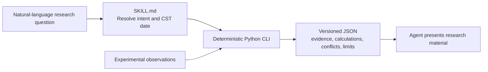

<div align="center">

# A-Share Research Skill

**Every research number should carry an identity, time boundary, source, and calculation lineage.**

[](https://www.python.org/)
[](skill/a-share-research/)
[](https://github.com/RedHeartSecretMan/a-share-research-skill/tree/v0.2.0)
[](LICENSE)

[中文](README.md) · [Installation](#installation) · [Common uses](#common-uses) · [Case demos](#case-demos) · [Boundaries](#boundaries) · [Development](#development)

</div>

`a-share-research-skill` is the project repository name; the installable Skill is `$a-share-research`. It takes an evidence-first approach to mainland-China listed-security research: a deterministic Python CLI handles security identity, research time boundaries, evidence validation, and valuation calculations, then an Agent presents the versioned JSON as auditable research material.

The project does not treat “an endpoint returned data” as “the fact is trustworthy.” It provides auditable research analysis only after security identity, research time, provenance, basis, and assumptions are explicit.

## Why it exists

Most data tools optimize for how much they can retrieve. This project asks whether a number is safe to use in a research conclusion:

- **Explicit identity**: security and issuer are separate; names and bare codes are clues, never permission to guess an exchange.
- **Explicit time**: every request is anchored to a China Standard Time date and distinguishes evidence, publication, and retrieval times.
- **Explicit provenance**: factual claims link to evidence and source locators; contract completeness is not source verification.
- **Reproducible calculations**: market capitalization, PE TTM, and PB MRQ use Decimal arithmetic and preserve full calculation lineage.
- **Honest failure**: ambiguity, conflict, staleness, wrong-security payloads, or missing critical evidence return `limited` / `blocked` instead of invented values.

## Capabilities

| Capability | Input | Output and boundary |
| --- | --- | --- |
| Security identity resolution | Name, abbreviation, or code clue + explicit date | Cross-checks SSE/SZSE and CNINFO observations; ambiguity, conflicts, and BSE inputs fail closed |
| Latest completed close | Canonical `SSE:code` / `SZSE:code` + explicit date | Cross-checks exchange daily lines and Tencent observations while preserving trading date, basis, and conflicts |
| Recent N-session trend | A-share clue + 2–250 sessions + unadjusted/forward-adjusted basis | Cross-checked OHLCV, cumulative return, drawdown, volatility, up/down sessions, volume change, and corporate actions |
| Intraday market snapshot | Current China Standard Time trading date + one canonical `SSE:code` / `SZSE:code` A-share | One TongdaXin/Tencent experimental cross-check with session, price type, source times, units, conflicts, and explicit `limited` / `blocked` boundaries |
| ETF market | Six-digit SSE ETF code + explicit date | SSE ETF identity and snapshot, Tencent price cross-check, and explicit board-lot rounding differences |
| ETF options | 510050 / 510300 / 510500 / 588000 + one observation date + ATM/chain, expiry, and quote-time modes | Separate standard `M` and adjusted `A` series, call/put quotes, tied ATM strikes, provider-reported Greeks/IV, four-state coverage, source time, and limitations |
| Automatic security valuation | A-share clue + established security-class count + current China Standard Time date + scenario target PE | Preserves complete numeric rows from all three statements and quarterly series, then acquires current shares and consensus to calculate reported and forward metrics |
| Same-basis valuation comparison | 2–10 unique A-share clues + shared date/target PE | Preserves every requested row with one price and metric basis; unavailable, meaningless, and blocked metrics remain explicit |
| Research-content retrieval | Theme/industry or one A-share + publication window + material types | Stock/industry reports, consensus, F10 issuer-profile material, news, CNINFO/SSE/SZSE announcements, market flashes, and investor Q&A with role, time, document identity, and locators preserved |
| Capital, positioning, and company events | One A-share or a market/board scope + observation window + data types | Northbound disclosure gaps, stock/board fund flow, stock and market dragon-tiger records, 90-day lockups, margin data, block trades, shareholder counts, and distributions with period, unit, direction, and market scope preserved |
| Market themes and trading signals | One A-share clue or market-wide scope + explicit observation date + signal types | Strong-stock themes, security board membership, industry rotation, limit pools, focus monitoring, severe abnormal movements, canonical-identity intersections, and market heat with rules, attribution provenance, four-state coverage, conflicts, and limitations preserved |

Experimental operations can provide observations and expose conflicts, but they have not completed operation-level qualification and cannot establish a `supported` factual claim alone.

Here, **F10 material** means the issuer information conventionally opened through an “F10” entry in Chinese securities-market software. v0.1.1 can retrieve latest notices, company overview, financial analysis, shareholder research, capital structure, capital operations, industry commentary, industry analysis, and company events. These are provider-compiled text materials, not an exchange-standardized dataset, statutory company disclosure, or independently verified company fact.

## How it works



Research results use three overall states:

- `supported`: every critical factual claim has applicable, source-verified evidence.
- `limited`: the core question remains answerable, but a non-critical gap, conflict, or source limitation must be disclosed.
- `blocked`: identity or critical evidence is insufficient, so substantive conclusions must stop.

## Analysis boundary

The CLI produces evidence, deterministic calculations, status, and limitations. When the result is not blocked and the question needs interpretation, the Agent may add a research judgment, risks, invalidation conditions, conditional trigger levels, and follow-up research suggestions. Direct-evidence questions such as identity checks receive no unrelated judgment; an overall `blocked` result states the gap and the evidence needed to continue.

This section is only a user-facing orientation. The normative rules for research judgments, conditional triggers, attributed external opinions, and investment-action advice are in the installed [`references/analysis-boundary.md`](skill/a-share-research/references/analysis-boundary.md). The researcher remains responsible for the final investment decision.

## Installation

The only installable artifact is [`skill/a-share-research`](skill/a-share-research/). Clone the repository, then copy the entire directory into a compatible Agent's Skill directory; do not copy `SKILL.md` alone.

```text
git clone --depth 1 --branch v0.2.0 --single-branch https://github.com/RedHeartSecretMan/a-share-research-skill.git

<skills-directory>/a-share-research/
├── SKILL.md
├── agents/openai.yaml
├── references/
└── scripts/
```

The core runtime requires only the Python 3.12 or later standard library and does not require installing this repository as a package. Below, `<python>` means an interpreter already confirmed to be version 3.12 or later: Windows normally uses `py -3.12`; macOS and Linux should prefer `python3.12`, and should use `python3` only after `python3 --version` confirms the requirement. See [`references/cli-contract.md`](skill/a-share-research/references/cli-contract.md) for the complete invocation contract.

F10 issuer-profile retrieval and the `intraday_market_signal` snapshot are capability-scoped optional capabilities and require an extra dependency. Install the release-audited version into the same Python environment that runs the corresponding Skill capability when needed:

```text
<python> -m pip install "mootdx==0.11.7"
```

The standard-library core installation does not include `mootdx`. When it is absent, only F10, `intraday_market_signal`, and steps explicitly dependent on them report `missing_optional_dependency` or return `blocked`; other research capabilities remain available. The runtime must not silently switch sources, fabricate empty data, or widen the blocked scope. The maintainer-only live probe uses an ephemeral home and does not create project-owned global configuration.

The F10 and `intraday_market_signal` integrations each pin `mootdx==0.11.7` within their capability scope. Its other quote interfaces do not become default sources or fallbacks merely because they ship in the same library. Each source operation must separately qualify identity, timing, units, failure semantics, and licensing, and must improve the evidence chain before integration; intraday never silently switches source when evidence is unavailable.

## CLI

All capabilities use the stable research-task Interface:

```text
<python> <skill-root>/scripts/entrypoint.py run --request <research-task.json>
```

`research-task.json` is a structured task, not natural-language text. It carries the version, task type, subjects, research date, window, parameters, and source policy. Unknown tasks, policy-disallowed sources, and missing optional Adapter dependencies return explicit `blocked` results.

`run --request` is the only supported public invocation. Callers do not need to know source endpoints, internal modules, or historical subcommands. `scripts/entrypoint.py` is the Skill's only public runtime entry point; every other Python module is an implementation detail. The CLI does not process natural language or call a model. `stdout` contains versioned JSON only and `stderr` contains diagnostics only. A valid `limited` or `blocked` result still exits with zero.

The intraday snapshot uses `task_type: "intraday_market_signal"`, exactly one canonical `SSE:<code>` or `SZSE:<code>` A-share, the current China Standard Time trading date, `window: null`, and `source_policy.allow_experimental: true`. `limited` means the snapshot remains answerable but experimental-source qualification or another disclosed limitation remains; `blocked` means identity, session, timing, or core-source evidence is insufficient. Agent analysis may interpret only a non-blocked result within the returned fields and limitations; it is not a trading feed, prediction, or action instruction.

### Preset research plans

`research_workflow` provides four fixed, versioned request plans. They are convenient orchestrations for common research questions, not separate data capabilities, and callers cannot supply custom steps or dependency graphs:

| Plan ID | Research question | Composition |
| --- | --- | --- |
| `single_security_valuation` | Value one security | Runs the existing `security_valuation` task |
| `valuation_comparison` | Compare several securities on one basis | Runs the existing `valuation_compare` task and preserves every row |
| `theme_report_research` | Find reports about a theme | Runs the existing `research_content` task |
| `new_security_research` | Perform a first systematic review of a security | Identity → institutional coverage → valuation → board membership → fund flow → dragon-tiger → lockup → margin trading |

Every plan inherits the request's research date and source policy and preserves each leaf task's status, evidence, conflicts, source errors, and limitations. The new-security plan gates dependent work on canonical identity; other blocked steps do not stop independent work, but the overall result is never described as complete or supported when required evidence is missing.

## Common uses

Invoke the Skill explicitly with `$a-share-research`. You may say “today” or “current”; the Agent resolves it to a concrete China Standard Time date first. The uses below match the task contracts in the v0.2.0 delivery baseline.

**Identify the right security**

> Use `$a-share-research` to confirm the exchange and canonical security code for “贵州茅台 (600519),” and tell me the date through which the result is valid.

**Look up the latest close**

> Use `$a-share-research` to find the latest completed unadjusted close for `SSE:600519` as of today, and tell me the sources, whether they agree, and any limitations.

**Inspect an intraday market snapshot**

> Use `$a-share-research` to inspect the research-grade intraday snapshot for `SSE:600519` at the current point today. Preserve the trading session, price type, both source-observation times, latest price, open/high/low, previous-close semantics, cumulative volume and amount, field lineage, conflicts, and limitations. If the session is not applicable or either source lacks sufficient evidence, return `blocked` instead of substituting the latest close.

**Research a recent trend**

> Use `$a-share-research` to research BlueFocus over the latest 10 completed sessions as of today on an unadjusted basis. Include OHLCV, cumulative return, maximum drawdown, volatility, up/down sessions, and volume change, then explain the trend, material risks, and invalidation conditions from that evidence. Label the conclusion as Agent inference; if you state a conditional trigger level, explain its rule and research horizon rather than phrasing it as a trading instruction.

**Look up an ETF market quote**

> Use `$a-share-research` to find the current or latest-completed quote for SSE 50ETF (510050) as of today. Include price, change, volume, amount, observation time, source agreement, and limitations.

**Research ETF options**

> Use `$a-share-research` to show the nearest-unexpired ATM call and put for SSE 50ETF (510050) at the latest completed session. Preserve quote state, bid, ask, last, volume, open interest, provider-reported Greeks/IV, units, observation time, source, and limitations.

> Use `$a-share-research` to show the source-observed option chain for CSI 300ETF (510300) at an exact expiry using latest-completed quotes. Keep standard `M` and adjusted `A` series separate and preserve tied ATM strikes and the contract-total limitation.

> Use `$a-share-research` to show the nearest-unexpired source-observed option chain for CSI 500ETF (510500), allowing the latest intraday quote and stating whether the session and coverage are complete.

> Use `$a-share-research` to show ATM options for STAR 50ETF (588000) at an exact expiry, allowing the latest intraday quote. If the source identifies another ETF, omits contracts, or has no usable quote, block instead of falling back or estimating.

“Provider-reported” means Delta, Gamma, Theta, Vega, and implied volatility come directly from the source; they are neither local BSM calculations by this project nor exchange-calculated values. Provider-native units for Gamma, Theta, and Vega are not independently verified; IV is a decimal fraction. The current source exposes no authoritative contract total, complete contract-unit definition, or adjustment terms and has no qualified independent fallback, so coverage and limitations must remain visible.

**Use the single-security valuation preset**

> Use `$a-share-research` to research Industrial Fulian's valuation as of today. First establish whether the issuer has only one priced ordinary-share class. Use the latest completed unadjusted close and calculate market cap, PE TTM, PB MRQ, first-forecast-year PE, forecast EPS growth, PEG, and the theoretical time to reach 30x PE. Separate mirrored statement observations, consensus opinions, and scenario assumptions, then use an explicit benchmark to explain valuation pressure, key assumptions, and reassessment conditions.

**Use the same-basis valuation-comparison preset**

> Use `$a-share-research` to compare Industrial Fulian, Kweichow Moutai, CATL, Midea Group, and Wuliangye using the same date, unadjusted-close basis, and 30x target PE. Establish each issuer's class scope first and preserve every missing item and limitation instead of dropping a security.

**Use the theme-report preset**

> Use `$a-share-research` to find reports published in the last 90 days about humanoid robots, lead screws, and reducers. List publication time, title, author, source, and PDF locator; merge duplicate documents and keep institutional opinions separate from disclosed facts.

**Use the new-security research preset**

> Use `$a-share-research` to run a complete new-security review for Industrial Fulian: establish identity, then review institutional reports and consensus, current valuation, provider board membership, latest five-session fund flow, dragon-tiger records, scheduled lockups over the next 90 days, and margin trading. Preserve evidence, source time, status, and limitations for every step. If one step is unavailable, continue steps that do not depend on it without describing the workflow as complete or supported.

**Research a security's announcements and news**

> Use `$a-share-research` to find BlueFocus announcements and stock news from the last 30 days. Prefer CNINFO or exchange original-document locators, explain the timeline, distinguish disclosure from media reporting, and state every remaining evidence gap.

**Review market flashes**

> Use `$a-share-research` to summarize today's market flashes through the current retrieval time, preserving each source and original publication time. Do not interpret source failure as “there was no news.”

**Review investor Q&A**

> Use `$a-share-research` to group the most common themes in BlueFocus investor Q&A over the last 90 days. First propose candidate themes from the raw material, then rerun auditable literal-frequency counts for those labels. Keep question time, company reply time, and original locator separate; present company replies as attributed statements rather than automatically verified facts.

**Review stock and board fund flow**

> Use `$a-share-research` in two separate tasks: review Industrial Fulian's main and order-size fund flows over the latest five completed sessions; then list the ten highest industry-board main inflows for the trading date attached to the provider's current ranking. State the period, amount unit, sign direction, market scope, retrieval time, and whether session completeness is established; do not present provider-defined flow buckets as company fundamentals.

**Check dragon-tiger records and lockups**

> Use `$a-share-research` to check whether BlueFocus appeared on the dragon-tiger list in the last 30 days, including the latest buy/sell top five and institution net amount. In a separate task, check scheduled lockups over the next 90 days. Preserve trigger reason, seat amount unit, released shares, and ratio basis; do not translate a failed or empty source into “none.”

**Review leverage, positioning, and distributions**

> Use `$a-share-research` to review Industrial Fulian's recent margin balances, block trades, shareholder-count changes, and distribution history. Distinguish trading dates, reporting periods, and implementation dates; keep every unit and direction explicit, and do not infer trading intent from shareholder-count changes.

**Check the northbound disclosure boundary**

> Use `$a-share-research` to explain which northbound metrics remain verifiable under the current disclosure regime and which net-flow fields are unavailable. Missing values must remain disclosure gaps and must never be converted to zero.

**Research themes, board membership, and industry rotation**

> Use `$a-share-research` in separate tasks to review strong securities and source-attributed theme reasons for the latest completed session, the provider boards currently associated with BlueFocus, and the day's industry performance ranking. Keep editorial reasons, board membership, and market snapshots distinct; do not present a theme tag as company fundamentals.

**Review limit pools, monitoring, anomalies, and heat**

> Use `$a-share-research` in separate tasks to review the latest completed session's limit-up, break, limit-down, and consecutive-limit ecology, the current provider focus-monitoring pool, severe abnormal movements with rule codes, and current market heat. Form a monitoring intersection only from matching canonical security identity and an overlapping monitoring window; never translate source failure or incomplete coverage into “none.”

These presets add no data shortcut: each runs a versioned plan of existing ResearchTasks, and the overall `limited` / `blocked` state must be presented together with step-level gaps. The future lockup step in the new-security plan uses its own explicit window capped at 90 days.

## Case demos

The cases start from real user research questions. BlueFocus cross-explains a 10-session trend with dragon-tiger, lockup, board, announcement, and news evidence; Industrial Fulian uses the new-security preset across identity, institutional material, valuation, boards, fund flow, dragon-tiger, lockups, and margin trading:

- [BlueFocus (SZSE:300058)](examples/bluefocus.md)
- [Industrial Fulian (SSE:601138)](examples/industrial-fulian.md)
- [Research-grade intraday snapshot (SSE:600519)](examples/intraday-snapshot.md)

The BlueFocus and Industrial Fulian cases keep fixed records anchored to `2026-08-02` and separately label the status and gaps of `2026-08-03` real-source smoke runs; the intraday case records only the request contract and stores no provider response. A rerun must use a new explicit research date and the evidence returned by the CLI.

## Boundaries

The current version is deliberately conservative:

- Network identity and close tracers cover SSE and SZSE only; BSE never falls back to another market.
- Free network operations are experimental sources, not production-qualified Adapters.
- Automatic valuation currently accepts only the current research date; shares, statements, and consensus operations remain experimental, so results are at most `limited`.
- The share count is a current observation, not an independently verified effective event; statements are provider-mirror observations whose correction/replacement semantics remain unqualified.
- Security-class count is never silently assumed. Unknown scope or A/H, A/B, or other multi-class issuers block issuer-wide valuation.
- Consensus is aggregated opinion, not a reported company fact; target PE is a user scenario input, not a fair-value conclusion.
- Reports, news, announcements, flashes, investor Q&A, and F10 material currently use experimental sources, so results are at most `limited`. F10 is a provider-compiled current snapshot whose publication time, document identity, and version-replacement semantics remain unqualified. A PDF locator does not prove download or parsing; only an explicit document-verification run may claim retrieval was checked.
- Fund flow, dragon-tiger records, lockups, margin data, block trades, shareholder counts, and distributions also use experimental sources. Provider-derived fund direction is a market signal, not authoritative disclosure. A rolling board metric keeps `period.start: null` when the first session is not exposed; a source with unknown first-availability time is usable only for research on its current retrieval date, never as a historical backtest input. When the post-19-August-2024 regime does not expose the old daily northbound net-buy metric, the task blocks explicitly instead of inserting zero.
- Themes, board membership, industry rotation, limit pools, monitoring, abnormal movement, and heat also use experimental sources. A provider watchlist is not an official exchange list, and editorial reasons or popularity labels do not prove causality or fundamentals. Only a completely collected zero pool is `observed_empty`, and provider-local codes cannot establish a monitoring intersection.
- ETF options currently cover experimental snapshots for 50ETF, 300ETF, 500ETF, and STAR 50ETF only. Provider-reported Greeks/IV are neither local-model nor exchange calculations; authoritative contract totals, contract units, adjustment terms, and an independent fallback remain unavailable. Preserve `M` / `A` series, quote state, units, timing, source, and coverage.
- Theme-report research defaults to exact title-keyword filtering over the Eastmoney market-wide report feed; this is not semantic search and does not prove a complete theme universe. Semantic iWencai search is an optional enhancement when source policy permits it and reads credentials only from `IWENCAI_API_KEY`; values never enter request JSON or output.
- Research-grade intraday snapshots for one SSE/SZSE A-share and ETF snapshots are supported; minute bars, ticks, continuous feeds, trading, news-sentiment scoring, full-company profiles, and batch screening are not.
- Research analysis and advice follow the installed [`analysis-boundary.md`](skill/a-share-research/references/analysis-boundary.md); this README does not define a second operational policy.

See [`CONTEXT.md`](CONTEXT.md) for the complete product domain and terminology. [`Spec 0001`](docs/specs/0001-current-valuation-evidence-brief.md) is the superseded early v0.0.1 valuation-kernel proposal; [`Spec 0002`](docs/specs/0002-trustworthy-a-share-research-foundation.md) defines the delivered v0.0.1 trustworthy-evidence kernel; [`Spec 0003`](docs/specs/0003-full-a-share-research-v0.1.0.md) defines the complete v0.1.0 capability and release gates; [`Spec 0004`](docs/specs/0004-a-share-research-v0.1.1-presentation.md) defines the v0.1.1 presentation-boundary and documentation release revision; and [`Spec 0005`](docs/specs/0005-research-grade-intraday-snapshot.md) defines the implemented v0.2.0 research-grade intraday snapshot available through `intraday_market_signal`. Release gates and read-back evidence are recorded separately in the [`v0.2.0 release audit`](docs/research/v0.2.0-release-audit-2026-08-03.md); one live probe never qualifies an experimental source for production.

## Repository layout

```text
skill/a-share-research/        sole installable artifact
tests/                         offline contract, regression, and distribution tests
examples/                      versioned requests and real-security research cases
docs/adr/                      architecture decisions
docs/research/                 time-anchored source feasibility research
docs/specs/                    product and implementation specifications
CONTEXT.md                     domain language and boundaries
```

## Development

Default tests are fully offline. Live-source probes are opt-in diagnostics and are not part of the ordinary CI gate.

```text
<python> -m unittest discover -s tests -p "test_*.py"
ruff check .
ruff format --check .
mypy skill/a-share-research/scripts
<python> /path/to/skill-creator/scripts/quick_validate.py skill/a-share-research
```

The live-source diagnostic entry point is `tests/live_probe_close.py`. The maintainer-only intraday dual-exchange probe is `tests/live_probe_intraday.py` and must be explicitly confirmed with a date:

```text
<python> tests/live_probe_intraday.py --confirm-live --as-of YYYY-MM-DD
```

It covers one SSE and one SZSE A-share and emits only a dated observation report with source identity, timing, session, price agreement, units, status, and sanitized failures. It is excluded from ordinary CI, writes no fixtures, persists no provider response, accepts no credentials, and creates no project-owned global configuration.

Run each vertical slice explicitly against live sources with versioned requests:

```text
<python> skill/a-share-research/scripts/entrypoint.py run --request examples/requests/bluefocus-10-day-trend.json
<python> skill/a-share-research/scripts/entrypoint.py run --request examples/requests/intraday-market-snapshot.json
<python> skill/a-share-research/scripts/entrypoint.py run --request examples/requests/510050-etf-market.json
<python> skill/a-share-research/scripts/entrypoint.py run --request examples/requests/510050-atm-options.json
<python> skill/a-share-research/scripts/entrypoint.py run --request examples/requests/510300-atm-options.json
<python> skill/a-share-research/scripts/entrypoint.py run --request examples/requests/510500-atm-options.json
<python> skill/a-share-research/scripts/entrypoint.py run --request examples/requests/588000-atm-options.json
<python> skill/a-share-research/scripts/entrypoint.py run --request examples/requests/workflow-single-security-valuation.json
<python> skill/a-share-research/scripts/entrypoint.py run --request examples/requests/workflow-valuation-comparison.json
<python> skill/a-share-research/scripts/entrypoint.py run --request examples/requests/workflow-theme-report-research.json
<python> skill/a-share-research/scripts/entrypoint.py run --request examples/requests/workflow-industrial-fulian-new-security.json
<python> skill/a-share-research/scripts/entrypoint.py run --request examples/requests/industrial-fulian-valuation.json
<python> skill/a-share-research/scripts/entrypoint.py run --request examples/requests/five-stock-valuation-compare.json
<python> skill/a-share-research/scripts/entrypoint.py run --request examples/requests/theme-report-search.json
<python> skill/a-share-research/scripts/entrypoint.py run --request examples/requests/bluefocus-f10.json
<python> skill/a-share-research/scripts/entrypoint.py run --request examples/requests/bluefocus-announcements-news.json
<python> skill/a-share-research/scripts/entrypoint.py run --request examples/requests/industrial-fulian-research-reports.json
<python> skill/a-share-research/scripts/entrypoint.py run --request examples/requests/industrial-fulian-announcements.json
<python> skill/a-share-research/scripts/entrypoint.py run --request examples/requests/market-flashes.json
<python> skill/a-share-research/scripts/entrypoint.py run --request examples/requests/bluefocus-investor-qa.json
<python> skill/a-share-research/scripts/entrypoint.py run --request examples/requests/industrial-fulian-5-day-fund-flow.json
<python> skill/a-share-research/scripts/entrypoint.py run --request examples/requests/industry-board-5-day-fund-flow.json
<python> skill/a-share-research/scripts/entrypoint.py run --request examples/requests/market-dragon-tiger.json
<python> skill/a-share-research/scripts/entrypoint.py run --request examples/requests/bluefocus-lockup-90-day.json
<python> skill/a-share-research/scripts/entrypoint.py run --request examples/requests/industrial-fulian-capital-events.json
<python> skill/a-share-research/scripts/entrypoint.py run --request examples/requests/market-strong-stock-themes.json
<python> skill/a-share-research/scripts/entrypoint.py run --request examples/requests/bluefocus-board-membership.json
<python> skill/a-share-research/scripts/entrypoint.py run --request examples/requests/market-industry-rotation.json
<python> skill/a-share-research/scripts/entrypoint.py run --request examples/requests/market-limit-ecology.json
<python> skill/a-share-research/scripts/entrypoint.py run --request examples/requests/market-focus-monitoring.json
<python> skill/a-share-research/scripts/entrypoint.py run --request examples/requests/market-severe-abnormal-movements.json
<python> skill/a-share-research/scripts/entrypoint.py run --request examples/requests/market-monitoring-intersection.json
<python> skill/a-share-research/scripts/entrypoint.py run --request examples/requests/market-heat.json
```

`intraday-market-snapshot.json` records the v0.2.0 release-date request shape. Before a later run, copy it and replace `as_of` with that run's current China Standard Time date; historical dates, non-trading dates, and non-applicable sessions intentionally return `blocked`. Without credentials, `theme-report-search.json` uses the limited Eastmoney title-keyword baseline. When source policy permits a local `IWENCAI_API_KEY`, iWencai is only an optional enhancement; no request may reuse or expose that value. `bluefocus-f10.json` exercises the integrated F10 capability that requires the optional `mootdx` dependency and should return an explicit blocked result when the dependency is absent.

The dated results and environment limitations for all eight market-signal scenarios are recorded in the [2026-08-02 live smoke record](docs/research/market-signals-smoke-2026-08-02.md).

## License and provenance

The project is licensed under [Apache-2.0](https://github.com/RedHeartSecretMan/a-share-research-skill/blob/main/LICENSE). It originated from [`simonlin1212/a-stock-data`](https://github.com/simonlin1212/a-stock-data) and retains its copyright and attribution; the current implementation is rebuilt around an evidence-first contract and maintained as an independent project.
