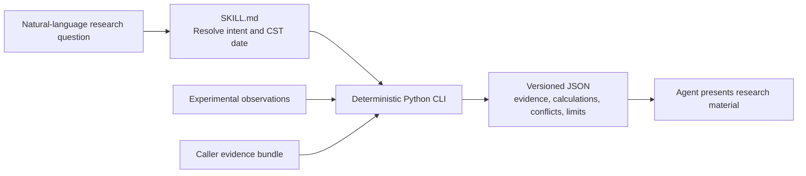

<div align="center">

# A-Share Research Skill

**Every research number should carry an identity, time boundary, source, and calculation lineage.**

[](https://www.python.org/)
[](skill/a-share-research/)
[](https://github.com/RedHeartSecretMan/a-share-research-skill/releases/tag/v0.0.1)
[](LICENSE)

[中文](README.md) · [Installation](#installation) · [Common uses](#common-uses) · [Case demos](#case-demos) · [Boundaries](#boundaries) · [Development](#development)

</div>

`a-share-research-skill` is the project repository name; the installable Skill is `$a-share-research`. It takes an evidence-first approach to mainland-China listed-security research: a deterministic Python CLI handles security identity, research time boundaries, evidence validation, and valuation calculations, then an Agent presents the versioned JSON as auditable research material.

The project does not treat “an endpoint returned data” as “the fact is trustworthy.” It does not provide ratings, price targets, position sizing, buy/sell advice, or cheap/expensive judgments.

## Why it exists

Most data tools optimize for how much they can retrieve. This project asks whether a number is safe to use in a research conclusion:

- **Explicit identity**: security and issuer are separate; names and bare codes are clues, never permission to guess an exchange.
- **Explicit time**: every request is anchored to a China Standard Time date and distinguishes evidence, publication, and retrieval times.
- **Explicit provenance**: factual claims link to evidence and source locators; contract completeness is not source verification.
- **Reproducible calculations**: market capitalization, PE TTM, and PB MRQ use Decimal arithmetic and preserve full calculation lineage.
- **Honest failure**: ambiguity, conflict, staleness, wrong-security payloads, or missing critical evidence return `limited` / `blocked` instead of invented values.

## Current main capabilities (v0.1.0 in development)

| Capability | Input | Output and boundary |
| --- | --- | --- |
| Security identity resolution | Name, abbreviation, or code clue + explicit date | Cross-checks SSE/SZSE and CNINFO observations; ambiguity, conflicts, and BSE inputs fail closed |
| Latest completed close | Canonical `SSE:code` / `SZSE:code` + explicit date | Cross-checks exchange daily lines and Tencent observations while preserving trading date, basis, and conflicts |
| Recent N-session trend | A-share clue + 2–250 sessions + unadjusted/forward-adjusted basis | Cross-checked OHLCV, cumulative return, drawdown, volatility, up/down sessions, volume change, and corporate actions |
| ETF market | Six-digit SSE ETF code + explicit date | SSE ETF identity and snapshot, Tencent price cross-check, and explicit board-lot rounding differences |
| Automatic security valuation | A-share clue + current China Standard Time date + scenario target PE | Acquires effective shares, financial statements, and consensus EPS; calculates market cap, PE TTM, PB MRQ, forward PE, forecast growth, PEG, and PE digestion time |
| Same-basis valuation comparison | 2–10 unique A-share clues + shared date/target PE | Preserves every requested row with one price and metric basis; unavailable, meaningless, and blocked metrics remain explicit |
| Evidence-bundle validation | Caller-provided `manifest.json` and optional materials | Validates identity, time, units, basis, hashes, locators, and evidence relationships |
| Provided-evidence valuation | Validated bundle + explicit date | Calculates market capitalization, PE TTM, and PB MRQ with formulas, operands, and report lineage |

Experimental operations can provide observations and expose conflicts, but they have not completed operation-level qualification and cannot establish a `supported` factual claim alone. Contract-complete caller evidence is not described as source-verified merely because its fields and hashes validate.

## How it works



Research results use three overall states:

- `supported`: every critical factual claim has applicable, source-verified evidence.
- `limited`: the core question remains answerable, but a non-critical gap, conflict, or source limitation must be disclosed.
- `blocked`: identity or critical evidence is insufficient, so substantive conclusions must stop.

## Installation

The only installable artifact is [`skill/a-share-research`](skill/a-share-research/). Clone the repository, then copy the entire directory into a compatible Agent's Skill directory; do not copy `SKILL.md` alone.

```text
git clone https://github.com/RedHeartSecretMan/a-share-research-skill.git

<skills-directory>/a-share-research/
├── SKILL.md
├── agents/openai.yaml
├── references/
└── scripts/
```

The runtime requires only the Python 3.12 or later standard library. It does not require installing this repository as a package or adding third-party Python dependencies. See [`references/cli-contract.md`](skill/a-share-research/references/cli-contract.md) for platform-neutral interpreter selection and invocation.

## CLI

New capabilities use the stable research-task Interface:

```text
<python> <skill-root>/scripts/entrypoint.py run --request <research-task.json>
```

`research-task.json` is a structured task, not natural-language text. It carries the version, task type, subjects, research date, window, parameters, and source policy. Unknown tasks, policy-disallowed sources, and missing optional Adapter dependencies return explicit `blocked` results.

The following four commands remain compatibility entry points during migration.

Experimental-source identity and close research:

```text
<python> <skill-root>/scripts/entrypoint.py resolve --query <security-clue> --as-of <YYYY-MM-DD>
<python> <skill-root>/scripts/entrypoint.py close --security <SSE:code|SZSE:code> --as-of <YYYY-MM-DD>
```

Provided-evidence valuation research:

```text
<python> <skill-root>/scripts/entrypoint.py validate-bundle --bundle <bundle-directory>
<python> <skill-root>/scripts/entrypoint.py valuation --bundle <bundle-directory> --as-of <YYYY-MM-DD>
```

`scripts/entrypoint.py` is the Skill's only public runtime entry point; every other Python module is an implementation detail. The CLI does not process natural language or call a model. `stdout` contains versioned JSON only and `stderr` contains diagnostics only. A valid `limited` or `blocked` result still exits with zero.

## Common uses

Invoke the Skill explicitly with `$a-share-research`. You may say “today” or “current”; the Agent resolves it to a concrete China Standard Time date first. The latest Release remains the v0.0.1 kernel preview; the trend and ETF uses below are on the main branch under development.

**Identify the right security**

> Use `$a-share-research` to confirm the exchange and canonical security code for “贵州茅台 (600519),” and tell me the date through which the result is valid.

**Look up the latest close**

> Use `$a-share-research` to find the latest completed unadjusted close for `SSE:600519` as of today, and tell me the sources, whether they agree, and any limitations.

**Research a recent trend**

> Use `$a-share-research` to research BlueFocus over the latest 10 completed sessions as of today on an unadjusted basis. Include OHLCV, cumulative return, maximum drawdown, volatility, up/down sessions, and volume change, then summarize the observed trend without giving trading advice.

**Look up an ETF market quote**

> Use `$a-share-research` to find the current or latest-completed quote for SSE 50ETF (510050) as of today. Include price, change, volume, amount, observation time, source agreement, and limitations.

**Check research materials**

> Use `$a-share-research` to check whether the research evidence in `/path/to/evidence-bundle` is complete and internally consistent, then prioritize what I still need to provide.

**Calculate common valuation metrics**

> Use `$a-share-research` with `/path/to/evidence-bundle` to calculate market capitalization, PE TTM, and PB MRQ. Include the calculation date, formulas, key inputs, and evidence limitations; if evidence is missing, tell me exactly what is needed.

**Research one security's valuation automatically**

> Use `$a-share-research` to research Industrial Fulian's valuation as of today. Use the latest completed unadjusted close and calculate market cap, PE TTM, PB MRQ, 2026 forward PE, forecast EPS growth, PEG, and the theoretical time to reach 30x PE. Separate reported facts, consensus opinions, and scenario assumptions; do not give trading advice.

**Compare several securities on one basis**

> Use `$a-share-research` to compare Industrial Fulian, Kweichow Moutai, CATL, Midea Group, and BYD using the same date, unadjusted-close basis, and 30x target PE. Preserve every missing item and limitation instead of dropping a security.

## Case demos

The cases start from real user research questions. BlueFocus covers “natural-language clue → identity → 10-session unadjusted OHLCV → metrics → trend conclusion”; Industrial Fulian covers “identity → price and shares → financial statements → consensus → reported and forward valuation”:

- [BlueFocus (SZSE:300058)](examples/bluefocus.md)
- [Industrial Fulian (SSE:601138)](examples/industrial-fulian.md)

The values are fixed live observations as of `2026-08-02`, retained to demonstrate result semantics and limitations. A rerun must use a new explicit research date and the evidence returned by the CLI.

## Boundaries

The current preview is deliberately conservative:

- Network identity and close tracers cover SSE and SZSE only; BSE never falls back to another market.
- Free network operations are experimental sources, not production-qualified Adapters.
- Automatic valuation currently accepts only the current research date; shares, statements, and consensus operations remain experimental, so results are at most `limited`.
- Consensus is aggregated opinion, not a reported company fact; target PE is a user scenario input, not a fair-value conclusion.
- ETF snapshots are supported; minute, tick, trading, news sentiment, full-company profiles, and batch screening are not yet supported.
- It does not provide ratings, price targets, buy/sell advice, position sizing, or automated trading instructions.

See [`CONTEXT.md`](CONTEXT.md) for the complete domain boundary, [`docs/specs/0002-trustworthy-a-share-research-foundation.md`](docs/specs/0002-trustworthy-a-share-research-foundation.md) for the current kernel specification, and [`docs/specs/0003-full-a-share-research-v0.1.0.md`](docs/specs/0003-full-a-share-research-v0.1.0.md) for the true v0.1.0 capability and release gates.

## Repository layout

```text
skill/a-share-research/        sole installable artifact
tests/                         offline contract, regression, and distribution tests
examples/                      versioned requests and real-security research cases
docs/adr/                      architecture decisions
docs/research/                 time-anchored source feasibility research
docs/specs/                    product and implementation specifications
CONTEXT.md                     domain language and boundaries
```

## Development

Default tests are fully offline. Live-source probes are opt-in diagnostics and are not part of the ordinary CI gate.

```text
python3.12 -m unittest discover -s tests -p "test_*.py"
ruff check .
ruff format --check .
mypy skill/a-share-research/scripts
python /path/to/skill-creator/scripts/quick_validate.py skill/a-share-research
```

The live-source diagnostic entry point is `tests/live_probe_close.py`. It never updates fixtures or lowers evidence requirements.

Run the market-series slice against live sources with the two versioned requests:

```text
python3.12 skill/a-share-research/scripts/entrypoint.py run --request examples/requests/bluefocus-10-day-trend.json
python3.12 skill/a-share-research/scripts/entrypoint.py run --request examples/requests/510050-etf-market.json
python3.12 skill/a-share-research/scripts/entrypoint.py run --request examples/requests/industrial-fulian-valuation.json
python3.12 skill/a-share-research/scripts/entrypoint.py run --request examples/requests/five-stock-valuation-compare.json
```

## License and provenance

The project is licensed under [Apache-2.0](https://github.com/RedHeartSecretMan/a-share-research-skill/blob/main/LICENSE). It originated from [`simonlin1212/a-stock-data`](https://github.com/simonlin1212/a-stock-data) and retains its copyright and attribution; the current implementation is rebuilt around an evidence-first contract and maintained as an independent project.
